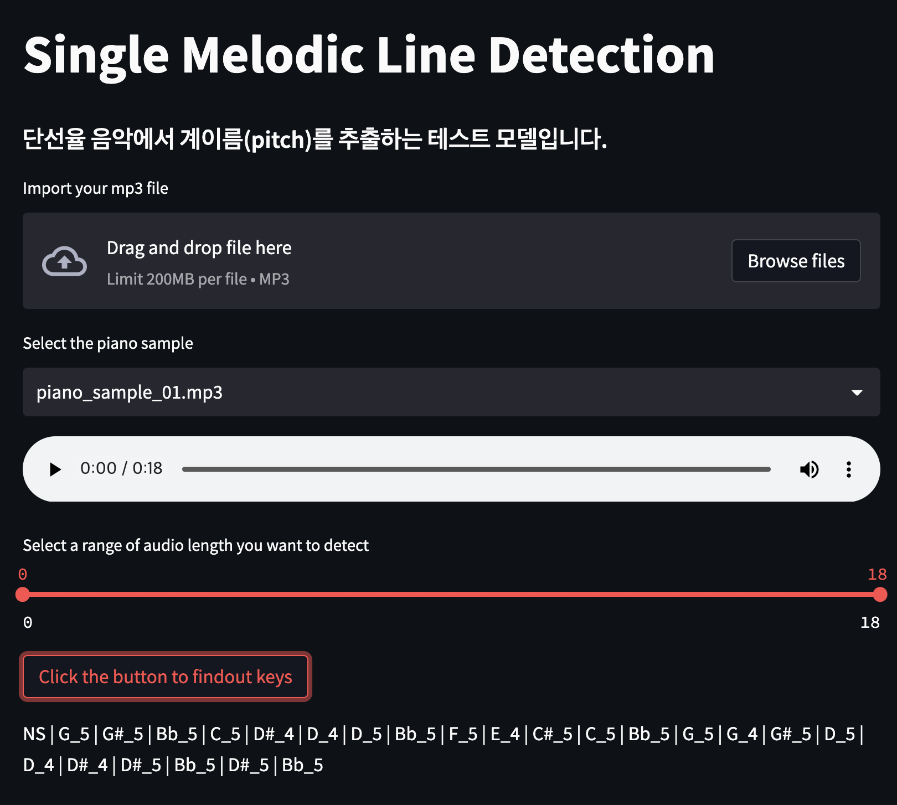

# Pitch Detection



## How does it work
statsmodels의 `acf`(auto-correlation function)과 scipy.signal의 `find_peaks` 모듈을 활용하여 음원 내 첫번째 peak 구간에서의 주파수를 탐색하여 이와 근접한 계이름 주파수와 매칭합니다.

```python
autocorrelation = sm.tsa.acf(sample, nlags=200)
# Find peaks of the autocorrelation
peaks = find_peaks(autocorrelation)[0]
# Choose the first peak as our pitch component lag
lag = peaks[0]
# Transform lag into frequency
pitch = int(samplerate / lag)
```


## Step
1. 오디오 샘플에서 numpy.ndarray로 불러온 데이터를 0.01초 단위로 peak 주파수를 스캔합니다.

2. 스캔된 주파수를 0.1초 단위로 그룹화하여 각 그룹에서 빈도수가 가장 높은 주파수를 채택합니다.

3. 마지막으로 다시 10개 단위로 그룹화하여 각 그룹에서 빈도수가 일정 수준 이하인 계이름은 제외합니다.